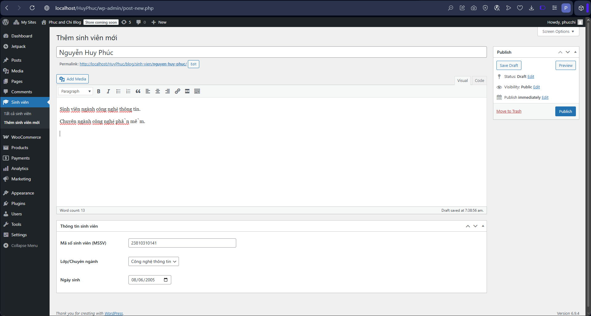
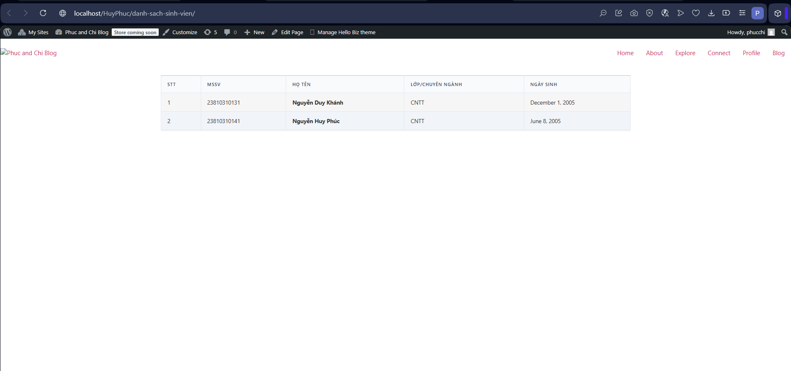

# Student Manager Plugin

## 1. Yêu cầu chức năng
Plugin **Student Manager** cung cấp giải pháp quản lý sinh viên trong WordPress. 
- **Backend:** Đăng ký Custom Post Type "Sinh viên" với các trường thuộc tính tiêu chuẩn (Họ tên, Ghi chú) và Custom Meta Boxes để nhập Mã số sinh viên, Chuyên ngành, Ngày sinh.
- **Frontend:** Cung cấp shortcode `[danh_sach_sinh_vien]` để hiển thị danh sách sinh viên theo dạng bảng HTML.

## 2. Cấu trúc plugin
```
wp-content/plugins/student-manager/
├── student-manager.php
├── includes/
│   ├── class-student-manager-cpt.php
│   └── class-student-manager-shortcode.php
├── assets/
│   └── css/
│       └── style.css
└── README.md
```

## 3. Kết quả (Screenshots)

### Giao diện thêm sinh viên (Backend)


### Bảng danh sách sinh viên (Frontend)


